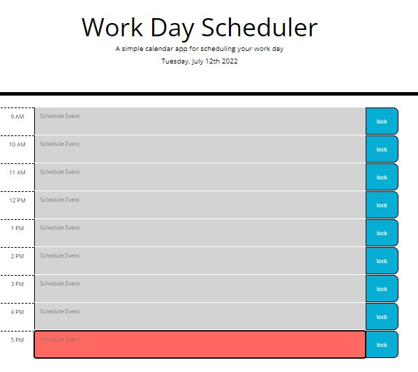

# Julian-Franklin-Work-Day-Scheduler

## Description

The Work Day Scheduler application is designed to allow users to schedule their work day. In the jumbotron of the website, users will view the title, description and today's date. Users can scroll to an hour time block to type an event in the text area, and click the lock button to the right of the text to save the event. Events are stored and visiable even if the page is refreshed. Keep track of your work day with the coloring changing event blocks that use grey, red, and green to show if the time block is in the past, present or furture. This website uses HTML, CSS, Bootstrap, JavaScript, Moment.js and jQuery. ~Created by Julian Franklin~

## Link to Website

[Julian Franklin's Work Day Scheduler](https://jfranklin12.github.io/Julian-Franklin-Work-Day-Scheduler/)

## Deployed Application Screenshot

